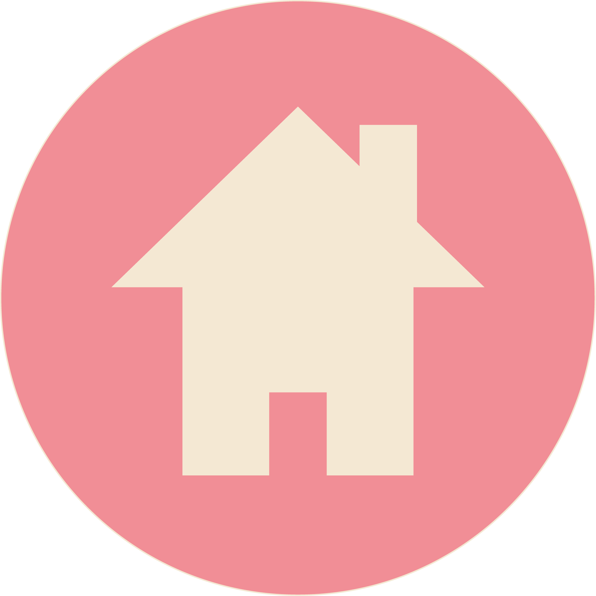

    
Kledingwinkels

<a href='#'><button class='knopjes roze_acht'>A-Z</button></a>
<a href='#'><button class='knopjes roze_acht'>Z-A</button></a>
<a href='#'><button class='knopjes roze_acht'>Kinderen</button></a>
<a href='#'><button class='knopjes roze_acht'>Mannen</button></a>
<a href='#'><button class='knopjes roze_acht'>Vrouwen</button></a>

    

    
    
    
    
    
    

