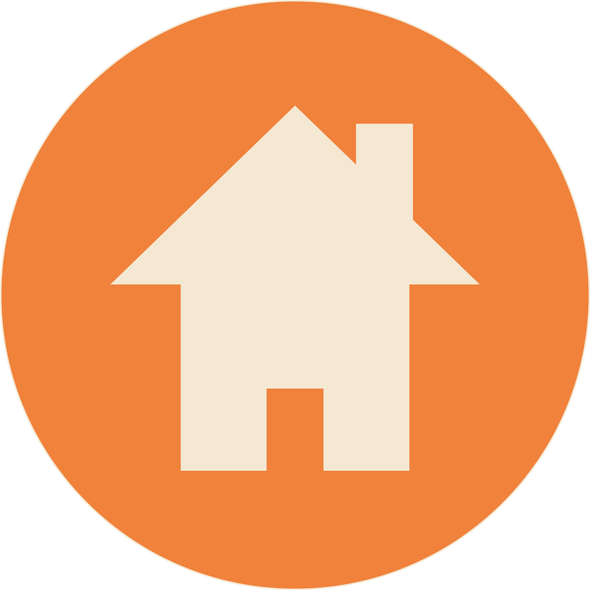
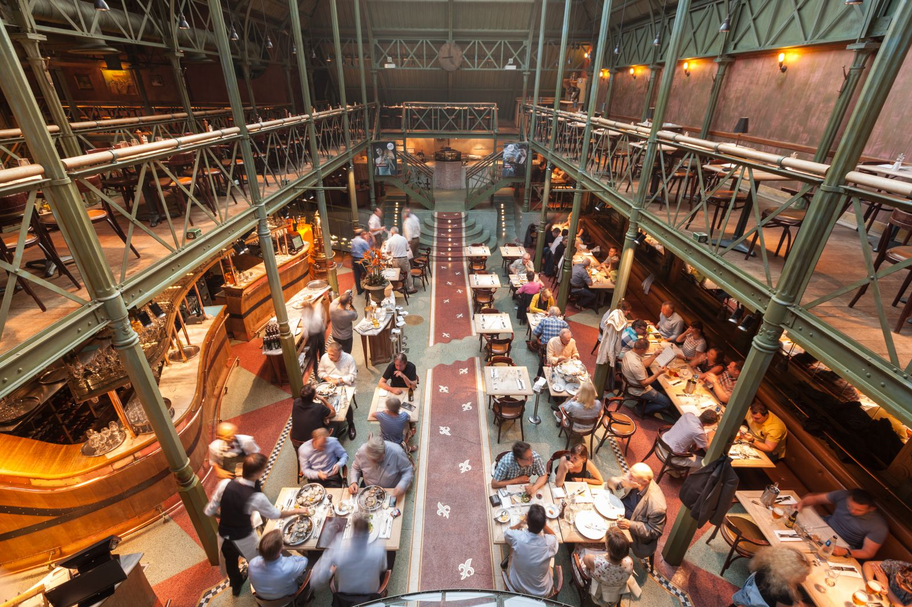
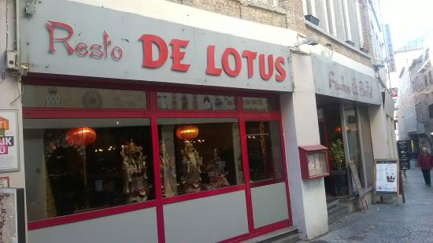
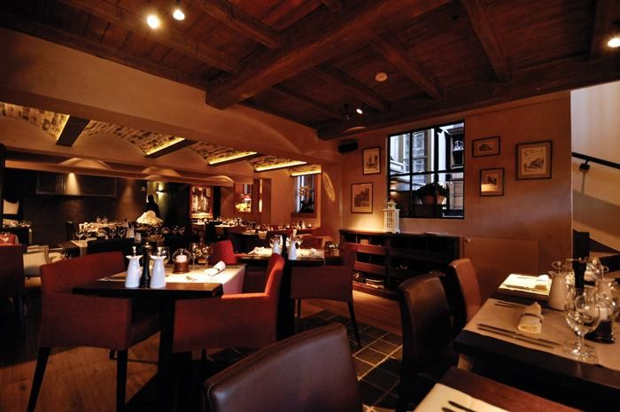
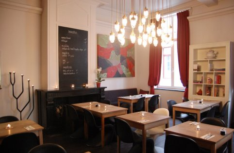
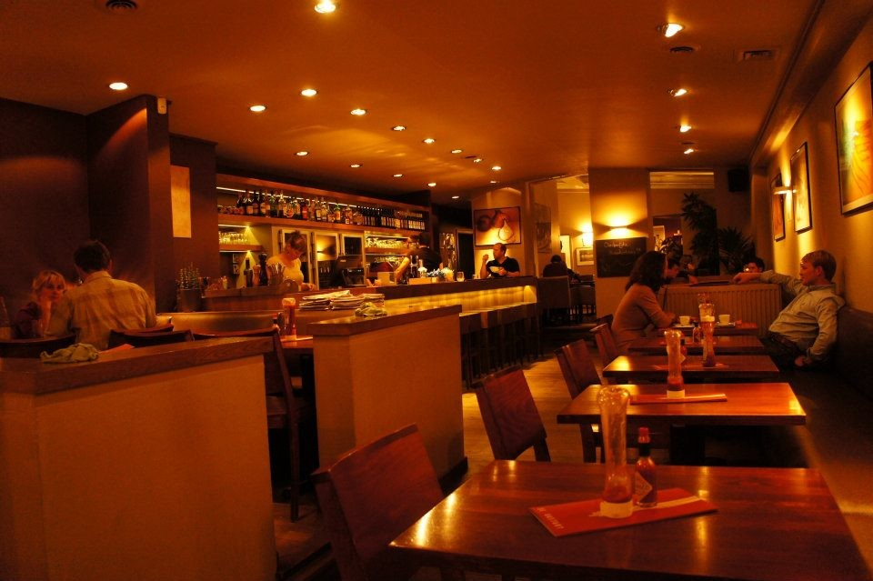
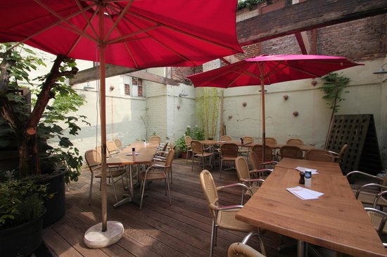
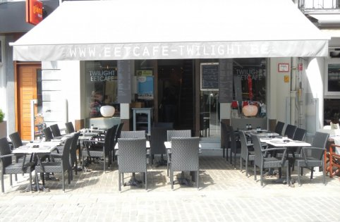
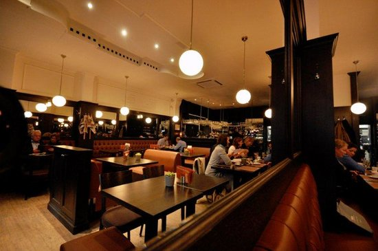

    
Restaurants

<a href='#'><button class='knopjes oranje_acht'>A-Z</button></a>
<a href='#'><button class='knopjes oranje_acht'>Z-A</button></a> 

    

    
    
    
    
    
    
    
    
    

