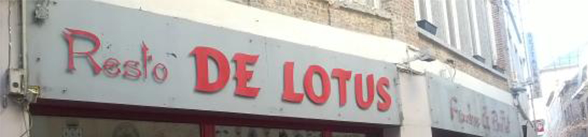

        

        
Chinese keuken boordevol lekkernijen.

        

                
Openingsuren

                
Maandag, woensdag - zondag:
 
                
11:00 - 15:00 & 17:00 - 23:00 

                
Dinsdag: 11:00 - 15:00

                
                
Locatie

                
Donkersteeg 11, 9000 Gent

                <iframe src="https://www.google.com/maps/embed?pb=!1m18!1m12!1m3!1d2507.9166694637333!2d3.721077451398958!3d51.05462645142687!2m3!1f0!2f0!3f0!3m2!1i1024!2i768!4f13.1!3m3!1m2!1s0x47c37146e4b186df%3A0xf34c1156d3a7f8dc!2sDe+Lotus!5e0!3m2!1snl!2sbe!4v1482422898091" class='maps_detail'  id='rand_oranje' width="45%" height="50%"></iframe>
        

