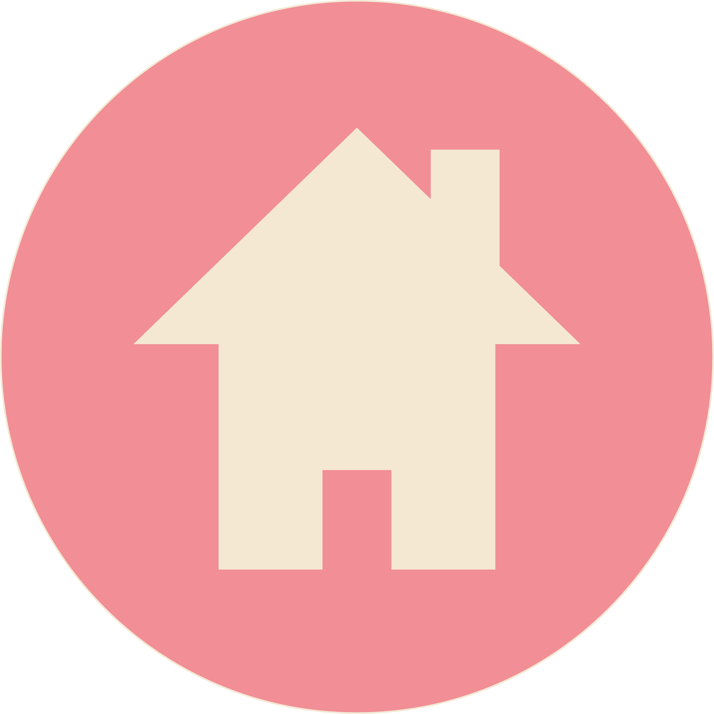

        
 Modeketen die kleding, schoenen, tassen en andere accessoires verkoopt.

        
        
                
Openingsuren

                
Maandag - donderdag:
 
                
9:30 - 18:00

                
Vrijdag - zaterdag:
 
                
9:30 - 18:30

                
Zondag: gesloten

                
                
Locatie

                
Donkersteeg 11, 9000 Gent

                

        

